<picture>
  <source media="(prefers-color-scheme: dark)" srcset="dark.svg">
  <source media="(prefers-color-scheme: light)" srcset="light.svg">
  
</picture>

<br/>

<!-- ════════════════════════════════════════════════════════════════════════════ -->
<!--                           GITHUB STATS SECTION                            -->
<!-- ════════════════════════════════════════════════════════════════════════════ -->

<div align="center">


&nbsp;&nbsp;


</div>

<div align="center">


</div>

<br/>

<!-- ════════════════════════════════════════════════════════════════════════════ -->
<!--                              ABOUT ME SECTION                             -->
<!-- ════════════════════════════════════════════════════════════════════════════ -->

<details open>
<summary><b>🧠 &nbsp;About Me</b></summary>
<br/>

```typescript
const akash = {
  name        : "Akash",
  location    : "Dwarka, New Delhi, India 🇮🇳",
  education   : "MCA @ GD Goenka University  |  SGPA: 8.8",
  bca         : "BCA @ Maharaja Surajmal Institute  |  94%",
  role        : "Full Stack Developer  |  AI/ML Engineer  |  Computer Vision Dev",
  current     : "Web Developer @ Raima Youth Foundation (Nonprofit, Remote)",
  contact     : "amanthesillent@gmail.com",
  interests   : ["RAG Pipelines", "Vector Databases", "Computer Vision", "Open Source"],
  funFact     : "I once reduced server memory by 80% just by switching AI inference to APIs 🚀",
};
```

</details>

<br/>

<!-- ════════════════════════════════════════════════════════════════════════════ -->
<!--                           TECH STACK SECTION                              -->
<!-- ════════════════════════════════════════════════════════════════════════════ -->

<details open>
<summary><b>🛠️ &nbsp;Tech Stack & Tools</b></summary>
<br/>

**Languages**


**Frontend**


**Backend**


**Databases & Cloud**


**AI / CV**


**DevOps & Tools**


</details>

<br/>

<!-- ════════════════════════════════════════════════════════════════════════════ -->
<!--                           PROJECTS SECTION                                -->
<!-- ════════════════════════════════════════════════════════════════════════════ -->

<details open>
<summary><b>🚀 &nbsp;Featured Projects</b></summary>
<br/>

<table>
  <tr>
    <td width="50%" valign="top">
      <h3>🤖 GuruTutor AI</h3>
      <p>
        A full-stack <strong>RAG-based AI tutoring platform</strong> for textbook-aware learning
        and autonomous MCQ generation. Reduced server memory by <strong>80%</strong> by offloading
        AI inference to external APIs.
      </p>
      <p>
        
        
        
        
      </p>
      <p><strong>🟢 LIVE</strong></p>
    </td>
    <td width="50%" valign="top">
      <h3>👁️ Face Recognition Attendance</h3>
      <p>
        A secure <strong>dual-authentication attendance system</strong> using face and palm recognition.
        Integrated Firebase for real-time data storage with a live web dashboard for monitoring.
      </p>
      <p>
        
        
        
        
      </p>
    </td>
  </tr>
  <tr>
    <td width="50%" valign="top">
      <h3>🎵 Apollo Music Player</h3>
      <p>
        A <strong>React Native music streaming app</strong> with AWS-backed online audio playback
        and a Global Radio feature for live worldwide station streaming.
      </p>
      <p>
        
        
        
      </p>
      <p>
        <a href="https://github.com/AKASH1922">
          
        </a>
      </p>
    </td>
    <td width="50%" valign="top">
      <h3>✋ Teach-AIR</h3>
      <p>
        A <strong>hand gesture recognition system</strong> enabling touchless digital interaction —
        drawing, erasing, and slide navigation using only computer vision techniques.
      </p>
      <p>
        
        
        
      </p>
      <p>
        <a href="https://github.com/AKASH1922">
          
        </a>
      </p>
    </td>
  </tr>
</table>

</details>

<br/>

<!-- ════════════════════════════════════════════════════════════════════════════ -->
<!--                         EXPERIENCE SECTION                                -->
<!-- ════════════════════════════════════════════════════════════════════════════ -->

<details open>
<summary><b>💼 &nbsp;Experience</b></summary>
<br/>

**Web Developer — Raima Youth Foundation** *(May 2025 – Present · Remote)*

> 🟢 **LIVE** — Nonprofit Organization
> - Designed, developed, and maintain the organization's **website from scratch**
> - Built an **admin dashboard** to manage member queries and organization membership
> - Enabled admins to **create and publish events** directly from the dashboard

</details>

<br/>

<!-- ════════════════════════════════════════════════════════════════════════════ -->
<!--                            CONNECT SECTION                                -->
<!-- ════════════════════════════════════════════════════════════════════════════ -->

<div align="center">

### 🤝 Connect With Me

[](https://github.com/AKASH1922)
[](https://Linkedin.com)
[](mailto:amanthesillent@gmail.com)

<br/>


<br/>

*⚡ "Building intelligent systems one commit at a time."*

</div>
